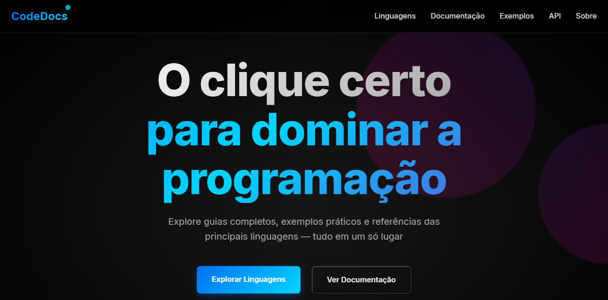
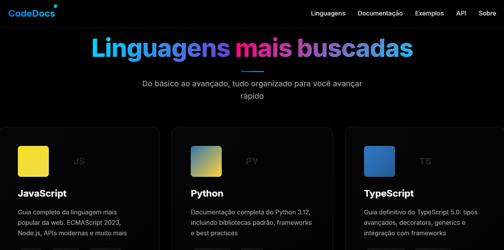
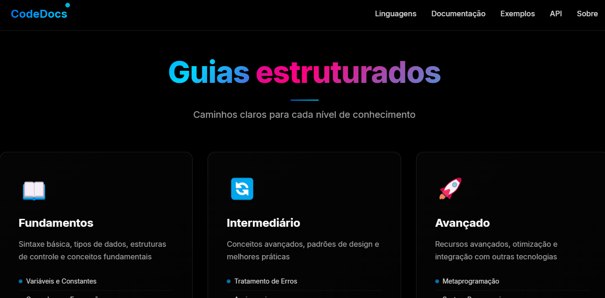

<p align="center">
 <a href="#tecnologias">Tecnologias</a>&nbsp;&nbsp;&nbsp;|&nbsp;&nbsp;&nbsp;
 <a href="#projeto">Projeto</a>&nbsp;&nbsp;&nbsp;|&nbsp;&nbsp;&nbsp;
 <a href="#como-usar">Como Usar</a>&nbsp;&nbsp;&nbsp;|&nbsp;&nbsp;&nbsp;
 <a href="#deploy">Deploy</a>&nbsp;&nbsp;&nbsp;|&nbsp;&nbsp;&nbsp;
 <a href="#preview">Preview</a>&nbsp;&nbsp;&nbsp;|&nbsp;&nbsp;&nbsp;
 <a href="#creditos">Crditos</a>
</p>

<br>

<p align="center">
 
</p>

<br>

<p align="center">
 
</p>

---
## Tecnologias
Esse projeto foi desenvolvido com as seguintes tecnologias:
- HTML5
- CSS3 (modularizado)
- JavaScript (ES6+)
- React JS
- Vite
---
## Projeto
**CodeDocs** uma plataforma interativa de documentao de linguagens de programao.
Ideal para estudantes, autodidatas e desenvolvedores que querem:
- Aprender de forma visual e prtica
- Consultar rapidamente APIs e exemplos reais
- Se aprofundar em diferentes nveis (bsico ao avanado)
A interface foi totalmente reestruturada com **React**, cada seo se tornou um
**componente separado com seus prprios estilos**, facilitando manuteno, escalabilidade e
legibilidade.
---
## Funcionalidades
- Navegao suave (scroll behavior)
- Layout 100% responsivo
- Estilo global + mdulos separados
- Componentizao por seo (Hero, Linguagens, Docs, API, etc)
- Deploy otimizado com Vite
---
## Como Usar
 ```bash
1. Clone o repositrio:

 git clone https://github.com/felipe-allves/CodeDocs

2. Acesse a pasta do projeto:
 cd CodeDocs-React

3. Instale as dependncias:
 npm install
 
4. Inicie o servidor de desenvolvimento:
 npm run dev

5. Acesse no navegador:
 [http://localhost:5173](http://localhost:5173)
 ```
---
## Deploy
[](https://app.netlify.com/projects/codedocss/deploys) 
 **Acesse em:** [CodeDocs](https://codedocss.netlify.app/)
---
## Preview
| Hero Section | Linguagens | Documentao |
|--------------|------------|--------------|
|  |  |  |
---
## Crditos
Feito com amor por [Felipe Alves](https://github.com/felipe-allves)
---
## Extras
- **Status do Projeto:** Em desenvolvimento
- **Issues:** Abertas para contribuies
- **Licena:** MIT
- **Verso em Ingls:** _Em breve_
---